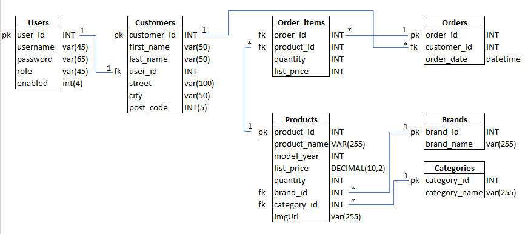

# Music Shop

This is a Java Spring Boot project made for Server Programming Course. 

## Features

- Login
- Product list
- Quantity tracking for products

#### Regular users:

- Shopping cart for registered users
- It is possible to make demo orders which affects the quantity of products
- Order history

#### Admin users:

All of above and

- CRUD-operations for products


## Usage

The project is contanerized so it is preferable to use the [docker-compose](docker-compose.yaml) for testing the app

```
$ docker-compose up
```
and the app will be up in running in http://localhost:8080 by default.

Upon starting the database structure is initialized using initial [schema](/src/main/resources/schema.sql) and populated with data by using [commandlinerunner](src/main/java/oinonen/MusicStore/MusicStoreApplication.java).

There are initially two user's created for testing:

| username | password                          |
|----------|-----------------------------------|
| user     | thisIsGeneratedUserPassword-1-2-3 |
| admin    | thisIsGeneratedPassword-1-2-3     |

## ERD


